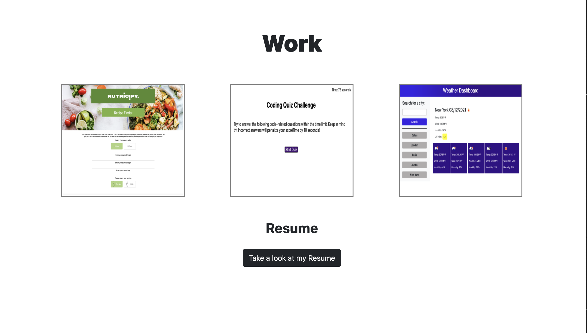
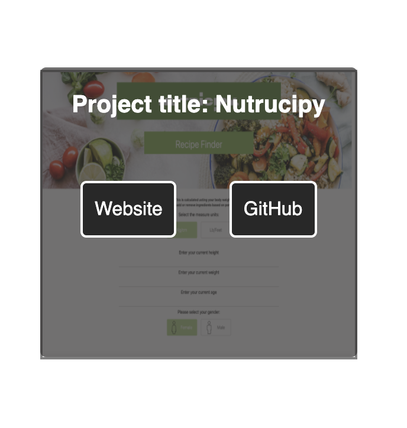
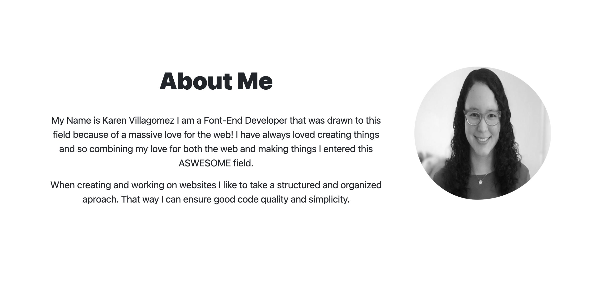
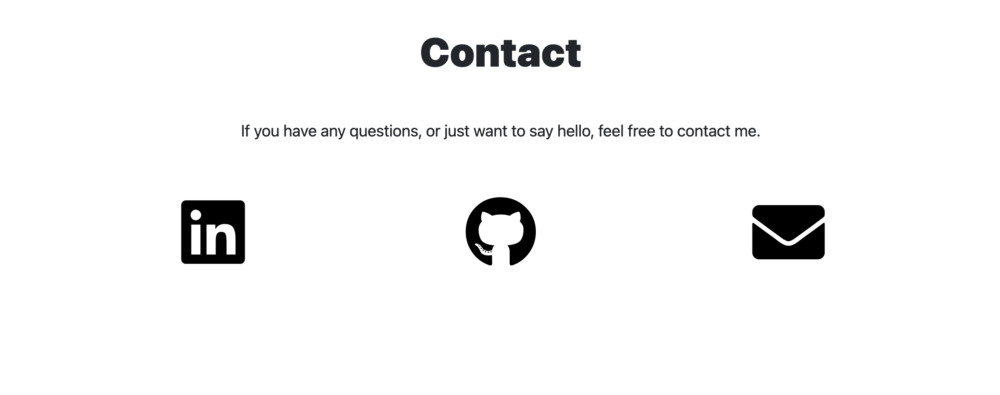
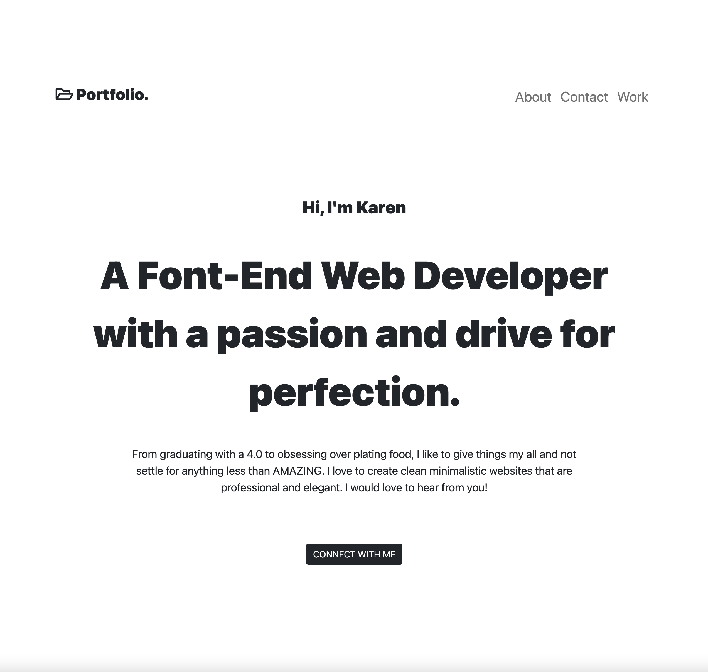

  

## Portfolio

This is Karen Villagomez's website portfolio. Where you can find:

- My Work and past projects.

---

When you hover over a project picture you will have access to the:
1. Project Name.
2. Github repo link.
3. Website link.

 
 

  

---

- An About-Me section.

---

- A Contact-Me section.

---

## Picture of website Intro

---
# Technologies used.

1. Bootstrap
2. CSS
3. HTML

#### Links:

###### Github:
https://github.com/KarenHarley/Portfolio

###### Website:
https://karenharley.github.io/Portfolio/
